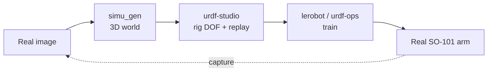

# Eurotech_HK_Hack

### REAL2SIM — Port Digital-Twin Pipeline

[](#)
[](https://github.com/huggingface/lerobot)

Rehearse the worst failure before it ever happens. Ports are getting faster and more automated. When something physical goes wrong — a crane drops a container, an AGV clips a vessel — it is rare, but it is expensive and dangerous. You cannot practice those failures live. So from **one image of a scene**, we build a **digital twin** you can break safely: a physics sim where you rig the moving parts, run a robot policy, and rehearse the failure in software instead of on the dock. The same loop also runs on a real tabletop **SO-101** robot arm, so what you train in sim plays back on real hardware.


## The loop



One real photo becomes a 3D world. The world gets rigged with degrees of freedom and replayed. Training runs on top. The result plays back on a real arm — and a fresh capture from that arm can start the loop again.

## Components

| Component | What it does | Deep dive | Source |
|---|---|---|---|
| **pulsar** | Interactive storyboard of the 8-stage REAL2SIM pipeline — the vision pitch and front-door demo for ports. | [docs/pulsar.md](docs/pulsar.md) | [rayan-elidrissi/pulsar](https://github.com/rayan-elidrissi/pulsar) |
| **simu_gen** | Turns one image into an interactive physics sim: a metric-scale gaussian-splat background plus textured object meshes. | [docs/simu_gen.md](docs/simu_gen.md) | [marinabar/simu_gen](https://github.com/marinabar/simu_gen) |
| **URDF Studio** | A local, Blender-style robotics workbench to load a URDF, rig joints, replay LeRobot episodes, and hand off to training. | [docs/urdf-studio.md](docs/urdf-studio.md) | [Nikerane/urdf-studio](https://github.com/Nikerane/urdf-studio) |
| **urdf-ops** | Training-operations workspace split from URDF Studio: owns keypoint extraction/validation and the `/training/*` endpoints. | [docs/urdf-ops.md](docs/urdf-ops.md) | [amtellezfernandez/urdf-ops](https://github.com/amtellezfernandez/urdf-ops) |
| **LeRobot SO-101** | Drives the physical SO-101 arm with LeRobot — find ports, calibrate, teleop, record, train, and replay Studio episodes. | [docs/lerobot-so101.md](docs/lerobot-so101.md) | [huggingface/lerobot](https://github.com/huggingface/lerobot) |

## Quickstart

### 1. Clone with submodules

This repo uses 5 git submodules. Clone them all at once:

```bash
git clone --recursive https://github.com/Nikerane/Eurotech_HK_Hack.git
```

Already cloned without `--recursive`? Pull the submodules in:

```bash
git submodule update --init --recursive
```

> `--recursive` pulls a lot: the `urdf-studio` fork has its own nested
> submodules (and re-pulls LeRobot). To start light, clone without `--recursive`
> and init only the part you need, e.g. `git submodule update --init pulsar`.

### 2. Pick a track

**See the vision (pulsar)** — the storyboard of the whole pipeline:

```bash
cd pulsar
python3 -m http.server 8080
# open http://localhost:8080/Real2Sim.html
```

You need a local server (not `file://`) because the page loads `.jsx` files over HTTP.

**Generate a world (simu_gen)** — turn an image into a 3D sim:

```bash
cd simu_gen
npm install
npm run setup    # enter World Labs + Replicate API keys
npm run dev      # viewer at http://localhost:5173
```

Open `http://localhost:5173/<slug>` to view a generated world.

**Run the workbench (urdf-studio)** — rig joints and replay episodes:

```bash
cd urdf-studio
npm run setup        # one time

# In this repo urdf-ops is a sibling folder, so point Studio at it:
URDF_OPS_ROOT="$(pwd)/../urdf-ops" npm run start
```

Then open URDF Studio at `http://127.0.0.1:5173` and URDF Ops at `http://127.0.0.1:5174`.

> Without `URDF_OPS_ROOT`, Studio may not find the training workspace. Set it to this repo's `urdf-ops` path (the absolute path also works).
Smoke test: on 5173, click `Play Sample Motion`, then in `Episodes` click the first play button. The robot should move and the graph cursor should track it.

**Drive the real arm (SO-101)** — replay a Studio episode on hardware:

```bash
# Find the USB port of the arm
lerobot-find-port

# Replay a Studio-exported episode on the follower arm
python replay_episode.py \
    --dataset /path/to/unzipped/so101_new_calib_v3 \
    --episode 0 \
    --port /dev/tty.usbmodem5AB01581111
```

Full bring-up — install, calibrate, teleop, cameras — is in [docs/setup.md](docs/setup.md).

## Repository layout

```
Eurotech_HK_Hack/
├── pulsar/             # submodule — pipeline storyboard / vision pitch
├── simu_gen/           # submodule — image → 3D world generator
├── urdf-studio/        # submodule (fork, branch hkgenesis) — rigging + replay workbench
├── urdf-ops/           # submodule — training & keypoint operations
├── lerobot/            # submodule — real SO-101 robot layer
├── replay_episode.py   # replay a Studio-exported LeRobot v3 episode on the follower arm
├── episodes/           # sample recorded episode(s) in LeRobot v3 parquet format
├── outputs/            # captured images from the real SO-101 hand-eye camera
├── docs/               # architecture + per-component deep dives + setup guide
└── README.md
```

The 5 submodules are pulled in by `git clone --recursive` (or `git submodule update --init --recursive`). Everything else — `replay_episode.py`, `episodes/`, `outputs/`, `docs/`, `README.md` — lives directly in this repo.

## Documentation

- [docs/architecture.md](docs/architecture.md) — the full real → sim → train → real loop and how the 5 parts connect
- [docs/pulsar.md](docs/pulsar.md) — pipeline storyboard and vision pitch
- [docs/simu_gen.md](docs/simu_gen.md) — image-to-world generator
- [docs/urdf-studio.md](docs/urdf-studio.md) — rigging and replay workbench
- [docs/urdf-ops.md](docs/urdf-ops.md) — training and keypoint operations
- [docs/lerobot-so101.md](docs/lerobot-so101.md) — real SO-101 robot layer
- [docs/setup.md](docs/setup.md) — SO-101 bring-up: install, calibrate, teleop, cameras

## Credits & license

A **Eurotech x HKTE** hackathon project, built from these components. Each one
keeps its own license — check the source repo before reusing any part.

| Component | Author | License |
|---|---|---|
| pulsar | [rayan-elidrissi](https://github.com/rayan-elidrissi/pulsar) | none stated |
| simu_gen | [marinabar](https://github.com/marinabar/simu_gen) | none stated |
| urdf-studio | [Nikerane](https://github.com/Nikerane/urdf-studio) (fork; branch `hkgenesis`) | proprietary — all rights reserved |
| urdf-ops | [amtellezfernandez](https://github.com/amtellezfernandez/urdf-ops) | AGPL-3.0 |
| lerobot | [Hugging Face](https://github.com/huggingface/lerobot) | Apache-2.0 |

This repo has no top-level license file yet. The glue code (`replay_episode.py`,
`docs/`) is unlicensed until one is added.


