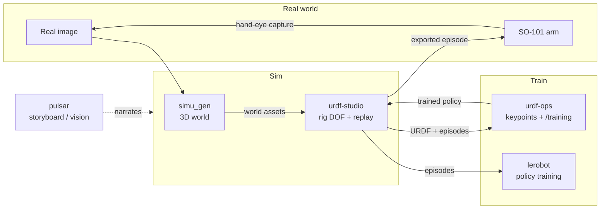

# Architecture — REAL2SIM

REAL2SIM is one loop with four moves: **real → sim → train → real**. Start with a real photo. Build a 3D world from it. Rig the moving parts and replay motion. Train a policy. Run that motion on a real robot arm. A capture from the real arm can start the loop again.

This doc explains each move, what data flows between the parts, and how the 5 components connect.

## The whole loop



**pulsar** sits beside the loop as the storyboard. It narrates all 8 stages — from the source photo to the rigged sim — and is the front door for a judge or a port operator who wants the story before touching code. See [docs/pulsar.md](pulsar.md).

## Move 1 — real → sim

### Start: one real image

The pipeline starts from a single photo of a scene. The demo scene is the Hong Kong Kwai Tsing container port. From that one image, **simu_gen** builds an interactive world in three steps:

1. **Segmentation** — find and cut out the objects in the scene (containers, cranes, vessels).

   

2. **Splat lift** — lift the background into a metric-scale gaussian splat, a clean 3D plate you can move a camera through.

   

3. **Mesh generation** — turn each cut-out object into a textured 3D mesh you can place and move.

   

### Output: world assets

simu_gen produces a **3D world**: a gaussian-splat background plus textured object meshes, at metric scale. simu_gen needs World Labs and Replicate API keys (`npm run setup`) and serves a viewer with `npm run dev`. Full details in [docs/simu_gen.md](simu_gen.md).

This world is the thing the robot will act in. It is the bridge from "a picture" to "a place a policy can be trained against."

## Move 2 — rig and replay

The generated world has shape but no joints. **URDF Studio** is where you give it degrees of freedom and where you inspect motion before training.

What URDF Studio does:

- **Load a URDF** — the robot (and rigged scene parts) described as links and joints.
- **Rig joints** — set the degrees of freedom that can move, like a crane arm or a gripper.
- **Replay LeRobot episodes** — play back a recorded motion and watch the joints and the value graph track together.
- **Hand off to training** — package what it has for the training side.

URDF Studio runs as a full local app (`npm run start`) with two surfaces: URDF Studio on `http://127.0.0.1:5173` and URDF Ops on `http://127.0.0.1:5174`. Smoke test: click `Play Sample Motion`, then play the first episode. Details in [docs/urdf-studio.md](urdf-studio.md).

### Data flow: URDF + episodes

The two things that leave URDF Studio:

- A **URDF** — the rigged robot/scene with its joints.
- **Episodes** — recorded motion in LeRobot dataset format. Each episode is parquet data: an `action` and `observation.state` per frame, named per joint, at a fixed frame rate. The sample episode in `episodes/` is LeRobot **v3.0** format: 7 named motors (`shoulder_pan`, `shoulder_lift`, `elbow_flex`, `wrist_flex`, `wrist_roll`, `gripper`, plus a virtual `gripper_frame_joint`), 30 fps, joint values in radians.

## Move 3 — train

Training is split across two parts.

**urdf-ops** is the training-operations workspace. It was split out of URDF Studio and owns:

- **Keypoint extraction and validation** — checking the perception observations that a policy will learn from.
- The **`/training/*` endpoints** — kicking off and monitoring training runs.

urdf-ops runs its own UI on `http://127.0.0.1:5174` and an API on `http://127.0.0.1:8001`. See [docs/urdf-ops.md](urdf-ops.md).

**lerobot** is the policy-training and real-robot library underneath. It consumes the episodes (the parquet datasets) and trains a policy. See [docs/lerobot-so101.md](lerobot-so101.md).

The trained policy flows back into URDF Studio so its motion can be replayed and checked in the rigged world — the same place the episodes came from.

## Move 4 — sim → real

The last move runs the motion on real hardware: a tabletop **SO-101** arm driven by LeRobot.

The bridge file is the root-level **`replay_episode.py`**. It takes a Studio-exported LeRobot v3 dataset and plays one episode on the SO-101 follower arm:

```bash
python replay_episode.py \
    --dataset /path/to/unzipped/so101_new_calib_v3 \
    --episode 0 \
    --port /dev/tty.usbmodem5AB01581111
```

Two details matter for the sim-to-real handoff:

- **Units.** URDF Studio exports joint positions in **radians** (URDF convention). The follower arm expects **degrees**. `replay_episode.py` converts radians to degrees before sending each action.
- **Virtual joints.** Some URDF joints (like `gripper_frame_joint`) are not real motors. The replay maps only the joints that have a physical motor and skips the virtual ones.

Bring-up for the real arm — install, find USB ports, calibrate both arms, teleoperate, set up cameras — is in [docs/setup.md](setup.md). Calibration is what makes a trained policy transfer to this specific robot, so the calibration files are saved and backed up.

## Closing the loop

The SO-101 carries a **hand-eye camera** mounted on the gripper. A capture from that camera (see `outputs/captured_images/`) is itself a real image — which can feed straight back into simu_gen as the start of a new world. That is what closes **real → sim → train → real** into a loop instead of a one-way pipeline.

## How the 5 components connect — at a glance

| From | To | What passes |
|---|---|---|
| Real image | simu_gen | a single photo |
| simu_gen | URDF Studio | 3D world assets (splat background + object meshes) |
| URDF Studio | urdf-ops / lerobot | URDF + recorded episodes (parquet) |
| urdf-ops / lerobot | URDF Studio | trained policy for replay |
| URDF Studio | SO-101 arm | exported episode (`replay_episode.py`, radians → degrees) |
| SO-101 arm | Real image | hand-eye camera capture |
| pulsar | (the team / judges) | the narrated story of the whole pipeline |

Deep dives per component: [pulsar](pulsar.md) · [simu_gen](simu_gen.md) · [urdf-studio](urdf-studio.md) · [urdf-ops](urdf-ops.md) · [lerobot-so101](lerobot-so101.md).
